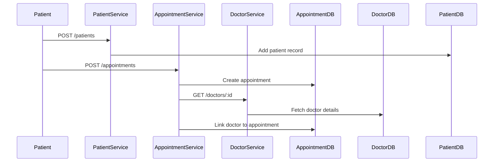

# HMS Microservices Architecture

## Overview
This application is a scalable Hospital Management System (HMS) built using a microservices architecture. Each core domain (appointments, billing, doctors, patients, payments, prescriptions) is implemented as a separate service, with its own database. The system is containerized using Docker and can be orchestrated with Docker Compose or Kubernetes (Minikube).

---

## Components

### 1. Microservices
Each service is a Node.js application with its own REST API and database connection:

- **Appointment Service** (`appointment-service`)
  - Manages appointments between patients and doctors.
  - Connects to its own Postgres database (`appointment-db`).
- **Billing Service** (`billing-service`)
  - Handles billing and invoices for patient treatments.
  - Connects to its own Postgres database (`billing-db`).
- **Doctor Service** (`doctor-service`)
  - Manages doctor profiles and schedules.
  - Connects to its own Postgres database (`doctor-db`).
- **Patient Service** (`patient-service`)
  - Manages patient records and information.
  - Connects to its own Postgres database (`patient-db`).
- **Payment Service** (`payment-service`)
  - Handles payment processing and records.
  - Connects to its own Postgres database (`payment-db`).
- **Prescription Service** (`prescription-service`)
  - Manages prescriptions issued to patients.
  - Connects to its own Postgres database (`prescription-db`).

Each service exposes its own API endpoint (e.g., `/appointments`, `/patients`, etc.) and communicates with its database only.

---

### 2. Databases
Each microservice has a dedicated PostgreSQL database container. This ensures data isolation and scalability. Database containers are named and configured to match their corresponding service.

---

### 3. Containerization
- **Docker Compose:**
  - Used for local development and testing.
  - Defines all services and databases in `docker-compose.yml`.
  - Volumes are used for database persistence.
- **Kubernetes (Minikube):**
  - Used for scalable, production-like orchestration.
  - Each service and database is defined as a Deployment and Service in YAML manifests (in the `k8s/` folder).
  - NodePort services expose APIs for external access.

---

## Service Interaction
- Services are loosely coupled and communicate via REST APIs.
- Each service is responsible for its own data and business logic.
- There is no direct database sharing between services.
- Services can be scaled independently.

---

## Data Flow Example
1. **Patient books an appointment:**
   - Patient Service creates/updates patient record.
   - Appointment Service schedules appointment with Doctor Service.
2. **Doctor issues a prescription:**
   - Prescription Service records prescription for patient.
3. **Billing and payment:**
   - Billing Service generates invoice for treatment.
   - Payment Service processes payment and updates billing status.

---

## Deployment Workflow
### Docker Compose
1. Run `docker-compose up --build` to start all services and databases.
2. Import initial SQL data if needed.
3. Test endpoints using Postman or similar tools.

### Kubernetes (Minikube)
1. Build Docker images inside Minikube's Docker daemon.
2. Apply manifests: `kubectl apply -f k8s/`
3. Import SQL data into database pods if needed.
4. Access services using `minikube service <service-name>`.

---

## Scaling & Fault Tolerance
- Each service can be scaled by increasing replica count in its Deployment.
- Failure in one service does not affect others (unless they depend on its API).
- Databases are isolated, reducing risk of data corruption.

---

## Security & Isolation
- Each service has its own database credentials and environment variables.
- No direct database access between services.
- Sensitive data (passwords, connection strings) should be managed via Kubernetes Secrets in production.

---

## Extensibility
- New services can be added easily by creating new microservices and database containers.
- APIs can be extended for new features.

---

## Folder Structure
```
appointment-service/
  Dockerfile
  index.js
  package.json
billing-service/
  Dockerfile
  index.js
  package.json
... (other services)
k8s/
  (Kubernetes YAML manifests)
db-init/
  (SQL initialization files)
docker-compose.yml
README.md
```
---

## System Overview

## Service Breakdown

### 1. Appointment Service
Purpose: Manages appointments between patients and doctors.
Main Endpoints:
- POST /appointments – Create appointment
- GET /appointments/:id – Get appointment details
- GET /appointments – List appointments
Function Calls:
- createAppointment(patientId, doctorId, time)
- getAppointment(id)
- listAppointments(filter)
Database: hms_appointments (Postgres)
Container: appointment-service:latest

### 2. Doctor Service
Purpose: Manages doctor profiles and schedules.
Main Endpoints:
- POST /doctors – Add doctor
- GET /doctors/:id – Get doctor details
- GET /doctors – List doctors
Function Calls:
- addDoctor(profile)
- getDoctor(id)
- listDoctors(specialty)
Database: hms_doctors (Postgres)
Container: doctor-service:latest

### 3. Patient Service
Purpose: Manages patient records.
Main Endpoints:
- POST /patients – Add patient
- GET /patients/:id – Get patient details
- GET /patients – List patients
Function Calls:
- addPatient(profile)
- getPatient(id)
- listPatients(filter)
Database: hms_patients (Postgres)
Container: patient-service:latest

### 4. Billing Service
Purpose: Handles billing and invoices.
Main Endpoints:
- POST /bills – Create bill
- GET /bills/:id – Get bill details
- GET /bills – List bills
Function Calls:
- createBill(patientId, amount, details)
- getBill(id)
- listBills(filter)
Database: hms_billing (Postgres)
Container: billing-service:latest

### 5. Payment Service
Purpose: Processes payments.
Main Endpoints:
- POST /payments – Make payment
- GET /payments/:id – Get payment details
- GET /payments – List payments
Function Calls:
- makePayment(billId, amount, method)
- getPayment(id)
- listPayments(filter)
Database: hms_payments (Postgres)
Container: payment-service:latest

### 6. Prescription Service
Purpose: Manages prescriptions.
Main Endpoints:
- POST /prescriptions – Add prescription
- GET /prescriptions/:id – Get prescription details
- GET /prescriptions – List prescriptions
Function Calls:
- addPrescription(patientId, doctorId, medication)
- getPrescription(id)
- listPrescriptions(filter)
Database: hms_prescriptions (Postgres)
Container: prescription-service:latest

---

## Application Setup & Containerization

### Folder Structure
```
Scalable-Services-Assignment-HMS-App/
│
├─ appointment-service/
│    ├─ Dockerfile
│    ├─ index.js
│    └─ package.json
├─ billing-service/
│    ├─ Dockerfile
│    ├─ index.js
│    └─ package.json
├─ doctor-service/
│    ├─ Dockerfile
│    ├─ index.js
│    └─ package.json
├─ patient-service/
│    ├─ Dockerfile
│    ├─ index.js
│    └─ package.json
├─ payment-service/
│    ├─ Dockerfile
│    ├─ index.js
│    └─ package.json
├─ prescription-service/
│    ├─ Dockerfile
│    ├─ index.js
│    └─ package.json
├─ db-init/
│    └─ *.sql
├─ k8s/
│    └─ *.yaml
├─ docker-compose.yml
└─ ARCHITECTURE.md
```

### Docker Compose Example
```
Build and start all services:
docker-compose up --build
Import SQL data if needed.
Test endpoints using Postman.
```

### Kubernetes Example
```
Build Docker images inside Minikube.
Apply manifests:
kubectl apply -f k8s/
Import SQL data into database pods.
Access services using:
minikube service <service-name>
```

---

## Service Communication Diagram

---

## Summary Table
| Service      | Port  | DB Name           | Main Functions                |
|--------------|-------|-------------------|-------------------------------|
| appointment  | 3001  | hms_appointments  | create, get, list appointments|
| billing      | 3002  | hms_billing       | create, get, list bills       |
| doctor       | 3003  | hms_doctors       | add, get, list doctors        |
| patient      | 3004  | hms_patients      | add, get, list patients       |
| payment      | 3005  | hms_payments      | make, get, list payments      |
| prescription | 3006  | hms_prescriptions | add, get, list prescriptions  |

---

## Extensibility & Security
- Add new services by creating new microservices and database containers.
- APIs can be extended for new features.
- Use Kubernetes Secrets for sensitive data in production.
- Each service is isolated for security and fault tolerance.

---

## Example Sequence: Booking an Appointment



---

## Summary
This HMS application is designed for modularity, scalability, and maintainability. Each domain is isolated, making it easy to develop, test, and deploy new features or services. The architecture supports both local development (Docker Compose) and cloud-native orchestration (Kubernetes/Minikube).
